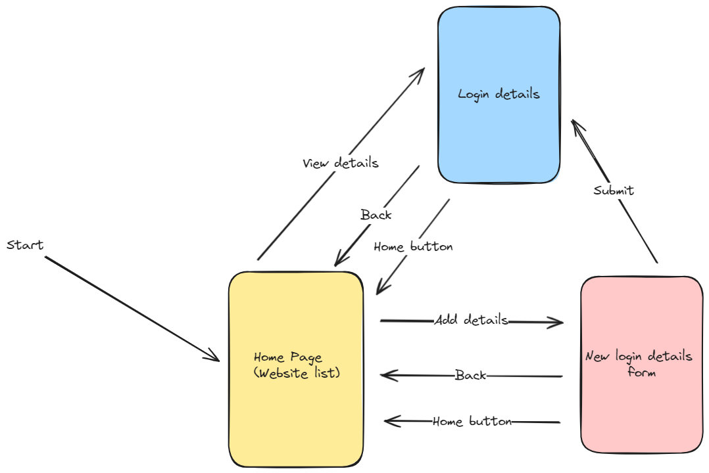
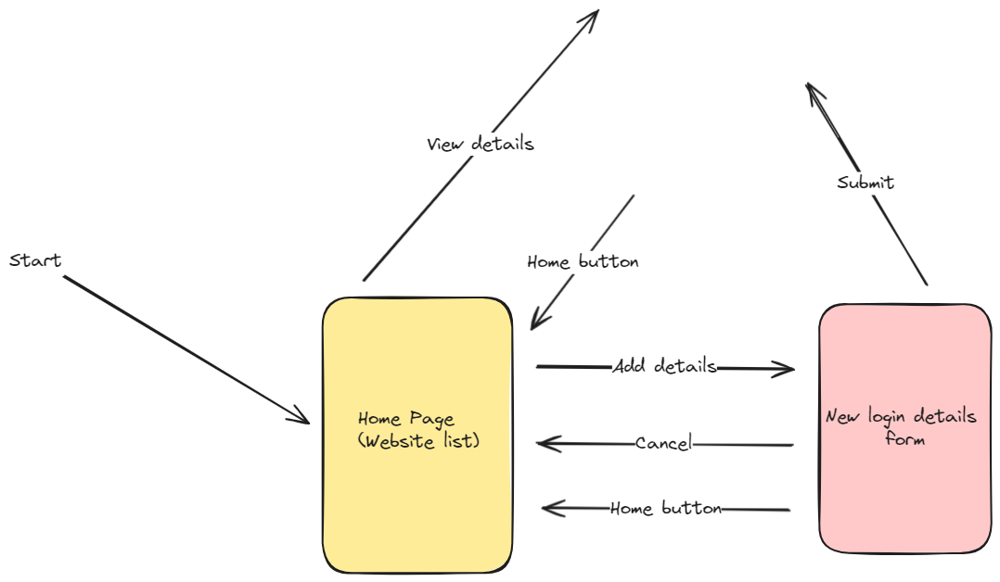
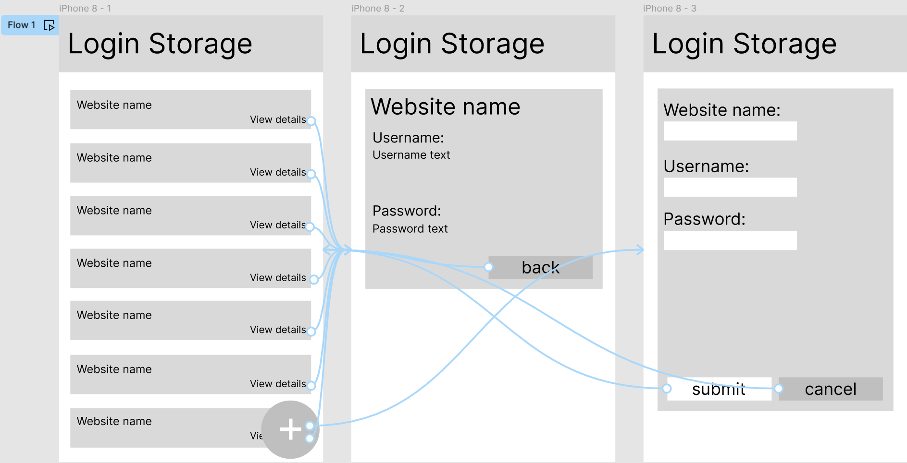
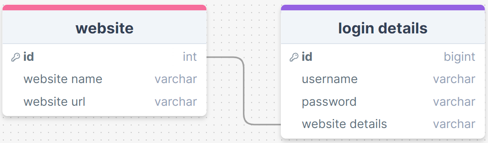
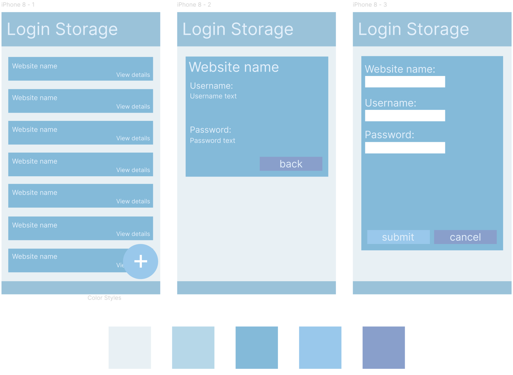

# The Design of a Database-Linked Website for NCEA Level 2

Project Name: **Password storage system**

Project Author: **Connor Taylor-Whitnell**

Assessment Standards: **91892** and **91893**

-------------------------------------------------

## Design, Development and Testing Log

## 21/05/2024

Today I worked on the general flowchart of the website. I sent a screenshot of this version to Benjamin and asked if he was okay with the design.

The flowchart shows how users will "flow" through the website, this will show me how to program the website in a way that is intuitive and has no pages that the user might get stuck on.

## 23/05/2024

Today I updated the flowchart, as Ben thought that some part didn't quite make sense, specifically the "back" button.

All I did was remove the "back" button from the Login details page and changed the button from "back" to "cancel" on the New login details form page.

## 30/05/2024

Finished the wireframe layout for the website, will get it sent to Ben before the end of the day.

I used Figma to make the wireframe layout that I intend to make the website look like.

## 11/06/2024

I have made the database plan for the website, I will check it with Ben.

I used Draw SQL to make the database plan that I intend to ue for the website to store all of the data needed

## 13/06/2024

I have made a basic colour scheme that I plan to implement into the website, I will check with Ben to confirm that these were the colours that he wanted.

I used RealTime Colours to make a colour scheme, and then use a plug-in to connect it with Figma and assign the different colours to their respectively.
